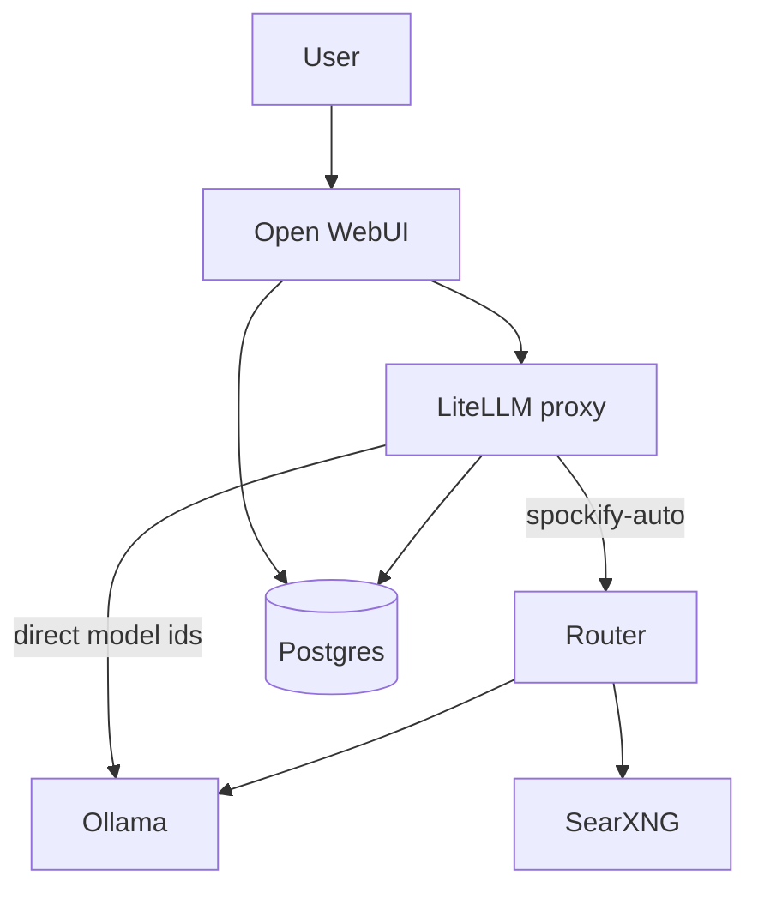

# Architecture

Spockify is a small set of services around open models. The chat UI never talks to
models directly — it goes through LiteLLM, and the `spockify-auto` model is served
by the router, which orchestrates routing, optional web search, and worker calls.

## Request flow (spockify-auto)

1. The UI sends an OpenAI-style chat request for `spockify-auto` to LiteLLM.
2. LiteLLM forwards `spockify-auto` to the router (`services/router`).
3. The router classifies the request (fast pattern rules first, then an
   orchestrator model for ambiguous cases), decides whether web search is needed,
   and picks a worker model.
4. If needed, it queries SearXNG and grounds the prompt with results.
5. It streams the worker model's answer (via LiteLLM/Ollama) back to the UI,
   annotated with which worker handled it.

Direct model ids (e.g. `llama3.1-8b`) bypass the router and go straight through
LiteLLM to Ollama.

## Components

| Component | Path | Role |
|-----------|------|------|
| Chat UI | `services/openwebui` | Open WebUI fork with Spockify UX |
| Router | `services/router` | `spockify-auto` orchestration, search gating, streaming |
| Model proxy | LiteLLM (image) | OpenAI-compatible front for Ollama/vLLM |
| Model runtime | Ollama (image) | Runs open models locally |
| Web search | SearXNG (image) | Private metasearch for grounding |
| Storage | Postgres (image) | Users, chats, config; Spockify SQL migrations in `sql/` |
| Editor/CLI | `extensions/`, `packages/` | VS Code-style extension + terminal agent |

## Configuration

- Models and routing targets: `config/litellm-dev.yaml`
- Router behavior: `config/orchestrator-prompt.md`, `config/routing-rules.json`
- Search: `config/searxng-settings-dev.yml`

All deployment specifics (secrets, storage location, GPU) are environment-driven;
see `.env.example` and `docker-compose.yml`.
